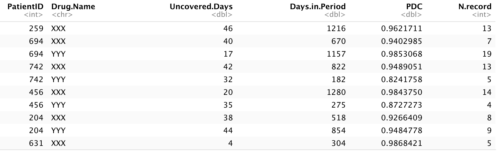
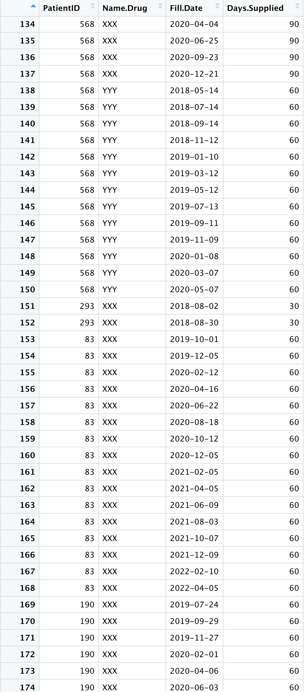

## Proportion of days covered (PDC)

Use to calculate the proportion of days covered

The function is called `pdc_cal` and it is really easy to use.


```r
df_pdc <- pdc_cal(data = df_simulated,
                  ID = 'PatientID',
                  Drug = 'Name.Drug',
                  Fill.Date = 'Fill.Date',
                  Days.Supplied = 'Days.Supplied')
```

You can use your own dataset to calculate it, I also provided a sample simulation code. You can calculate the pdc using our sample simulation data.




## Simulation

Just run following code to get the simulation dataset df_simulated and run the function above to calculate the proportion of days covered.

```{r}

N_Patients <- 1000

PID <- sample(1:1000, N_Patients, replace = F)

simulated_list <- list()
for (i in 1:length(PID)) {
  set.seed(PID[i] )
  start_date <- sample(seq(as.Date('2018/01/01'), as.Date('2020/01/01'), by="day"), 1)
  days_supplied <- sample(c(30, 60, 90), 1)
  fill.date <- start_date + cumsum(sample( (days_supplied - sample(1:10, 1)):(days_supplied + sample(1:10, 1)), sample(1:20, 1), replace = T ))
  simulated_list[[i]] <- data.frame(PatientID = PID[i],
                           Name.Drug = 'XXX',
                           Fill.Date = fill.date,
                           Days.Supplied = days_supplied)
  if( PID[i] %% 2 ==0 ){

      start_date <- sample(seq(as.Date('2018/01/01'), as.Date('2020/01/01'), by="day"), 1)
      days_supplied <- sample(c(30, 60, 90), 1)
      fill.date <- start_date + cumsum(sample( (days_supplied - sample(1:10, 1)):(days_supplied + sample(1:10, 1)), sample(1:20, 1), replace = T ))
      simulated_list[[i]] <- rbind(simulated_list[[i]],
                                   data.frame(PatientID = PID[i],
                                              Name.Drug = 'YYY',
                                              Fill.Date = fill.date,
                                              Days.Supplied = days_supplied))
  }else if( PID[i] %% 3 ==0 ){


      start_date <- sample(seq(as.Date('2018/01/01'), as.Date('2020/01/01'), by="day"), 1)
      days_supplied <- sample(c(30, 60, 90), 1)
      fill.date <- start_date + cumsum(sample( (days_supplied - sample(1:10, 1)):(days_supplied + sample(1:10, 1)), sample(1:20, 1), replace = T ))
      simulated_list[[i]] <- rbind(simulated_list[[i]],
                                   data.frame(PatientID = PID[i],
                                              Name.Drug = 'ZZZ',
                                              Fill.Date = fill.date,
                                              Days.Supplied = days_supplied))    
      }
}

df_simulated <- do.call(rbind, simulated_list)

df_simulated

write.csv(df_simulated, file = 'simulated.csv')

```



